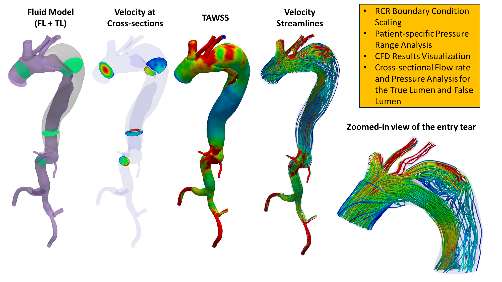

<h1 align="center">
  Processing and Visualization of CFD/FSI Results of Type B Aortic Dissection  using SimVascular and Paraview 
  <br>
</h1>

<h4 align="center">This repository contains code that helps run large-scale Computational Fluid Dynamics (CFD) and Fluid-structure Interaction (FSI) experiments on patients with Type B Aortic Dissection using SimVascular and Paraview. [<a href="https://doi.org/10.1038/s41598-024-78348-9" target="_blank">Paper</a>]</h4>

<p align="center">
  <a href="#repository-structure">Repository Structure</a> •
  <a href="#all-scripts">All Scripts</a> •
  <a href="#environment-set-up">Environment Set-up</a> •
  <a href="#mesh_prepobj_to_vtp">mesh_prep/obj_to_vtp</a> •
  <a href="#mesh_prepseparate_flap">mesh_prep/separate_flap</a> •
  <a href="#rcr_prep">rcr_prep</a> •
  <a href="#compflow">compflow</a> • 
  <a href="#analysisrange">analysis/range</a> •
  <a href="#analysisparaview">analysis/paraview</a> •
  <a href="#resources">Resources</a>
</p>

<!-- TODO UPDATE -->


## References 
Messou, J. C. E., Yeung, K., Sudbrook, E., Zhang, J., Toursavadkohi, S., Ucuzian, A. A., & Tubaldi, E. (2024). **Investigating the role of thrombosis and false lumen orbital orientation in the hemodynamics of Type B aortic dissection**. Scientific Reports, 14(1), 27379. 
[DOI: 10.1038/s41598-024-78348-9](https://doi.org/10.1038/s41598-024-78348-9)

## Repository Structure
* **mesh_prep/obj_to_vtp**: Convert .obj file (Meshmixer) to .vtp file using Paraview, automatically attribute face names, and generate a .mdl for SimVascular 
* **mesh_prep/separate_flap**: Identify the flap and separate it from the wall by assigning different DOMAIN_IDs (2 for the wall, 3 for the flap)
* **rcr_prep**: Scale total resistance and capacitance, then output RCR at each outlet
* **compflow**: C++ wrapper that calculates the pressure and flow rate at the faces using SimVascular
* **analysis**
  - **range**: Comparison of model's pressure VS Patient's blood pressure
  - **paraview**: Visualization + Processing of final CFD/FSI results


## All Scripts 
<!-- * Bash scripts (can be run with bash or slurm)
  - ...sh
  - ...sh -->
* **Python scripts** (see bash scripts for sample runs or examples below)
  - mesh_prep/obj_to_vtp/src/convert_obj_to_vtp.py
  - mesh_prep/separate_flap/src/paraview_separate_flap.py
  - rcr_prep/get_rcr.py
  - analysis/range/src/range_analyze.py
  - analysis/paraview/src/paraview_analyze.py


## Environment Set-up
* Python Version: 3.9.13
* [Paraview 5.11](https://www.paraview.org/download/)
* Code tested in Ubuntu 20.04.6 LTS
```
conda env create --name aorta --file ad_environment.yml
conda activate aorta
```
## mesh_prep/obj_to_vtp
* **Goal**: Convert a Meshmixer model (.obj) so it can be read in SimVascular (.vtp + .mdl)
  1) Convert .obj file (from Meshmixer or external source) to .vtp file using Paraview
  2) Add 1 to 'GroupIds' and replace it with 'ModelFaceID' to support face identication in Simvascular.
  3) Automatically attribute face names and generate separate .mdl file (See SimVascular) <!-- * Bash script: rcr_prep/get_rcr.sh -->
* **Python script**: mesh_prep/obj_to_vtp/src/convert_obj_to_vtp.py (see python file for more details)
* **Input(s)**:
    - Input .obj file to be converted; convert all available .obj files if directory is provided, -i (file/directory path)
    - Model type (fluid or solid), 13 faces for fluid, 14 faces for solid, --model_type (string)
    - Output directory where the converted model will be written. Defaults to the input obj file folder if not provided, -o (folder path)
    - Argument to disable .mdl file creation (step 3), --dont_get_face
* **Output(s)**:
    - A .vtp model with a ModelFaceID array instead of GroupIds (.vtp)
    - A SimVascular description file (.mdl) with the ModelFaceIDs, face_names, face_types, etc... (.mdl)
    - A text file with the ModelFaceIDs, face_names, and face_types (.txt)
    - A csv file with infos about each face (.csv)

Example 1:
```
FULL_PATH/pvpython convert_obj_to_vtp.py -i ../test/test_solid.obj -o .
```
```
Output:
test_solid_face_id.txt
test_solid_face_info.csv
test_solid.mdl
test_solid.vtp
```

## mesh_prep/separate_flap
* **Goal**: Identify the FLAP in the solid mesh and separate it from the WALL using the solid and the outer/inner wall surface meshes.
  1) The DOMAIN_ID array is overwritten (or created) with ID 2 for the WALL and ID 3 for the FLAP. The suffix "_old" will be appended to the original solid mesh.
  2) Regions provided in the solid folder as "mesh_to_remove_*vtu" will be fixed as the WALL.
  3) The function get_patient_info() can be updated to provide a plane where the elements
      above the plane are fixed as the wall. <!-- * Bash script: rcr_prep/get_rcr.sh -->
  4) Run FULL_PATH_TO/pvpython paraview_separate_flap.py -h for more details on arguments and tips
* **Python script**: mesh_prep/separate_flap/src/paraview_separate_flap.py (see python file for more details)
* **Input(s)**:
  - Path to a folder with structure shown below OR path to a VTU solid mesh, first argument (file/directory path)
    - mesh/*solid*/*vtu
    - mesh/*solid*/mesh-surfaces/solid_wall_outer.vtp
    - mesh/*solid*/mesh-surfaces/solid_wall_inner.vtp
  - Path to a VTP file representing the outer wall surface mesh. (Not needed if file_or_folder_path expected structure is respected), --wall_outer_path (file path)
  - Path to a VTP file representing the inner wall surface mesh. (Not needed if file_or_folder_path expected structure is respected), --wall_inner_path (file path)
  - Number of neighbors for Knn (if the OUTER WALL is within nb_neighbors cells, the cell is classifed as a WALL cell), -n, --nb_neighbors (interger)
  - Argument to save the state for easy visualization (PATH_TO_VTU_SOLID_FlowState.pvsm), --save_state
  - Argument to overwrite the old solid mesh and not save a copy, --dont_copy_old_mesh
    
* **Output(s)**:
    - A .vtp model with a ModelFaceID array instead of GroupIds (.vtp)


Example 1:
```
FULL_PATH_TO/pvpython paraview_separate_flap.py  ../test/test_1 --save_state
```
```
Output:
../test/test_1/mesh/test_solid-mesh-complete/mesh-complete.mesh.vtu  (overwritten)
../test/test_1/mesh/test_solid-mesh-complete/mesh-complete.mesh.vtu_old0 (original mesh)
../test/test_1/mesh/test_solid-mesh-complete/mesh-complete.mesh_FlowState.pvsm  (state file)
```

## rcr_prep
* **Goal**: Write RCR boundary conditions (BC) based on outlet flow fractions and R/C scaling factors. Replace the RCR BCs in the svFSI.inp file (if provided) with the new values. <!-- * Bash script: rcr_prep/get_rcr.sh -->
* **Python script**: rcr_prep/get_rcr.py (see python file for more details)
* **Input(s)**:
    - Total resistance scale factor, -R (float)
    - Total capacitance scale factor, -C (float)
    - A file with the outlet flow fractions, --flow_fractions_p (.txt)
    - A file with the order in which the outlets will be written to the output file, --outlet_order_p (.txt)
    - A path to an output directory, --out_dir (directory path)
    - (If svFSI used) File with potential face names (needed if svfsi_file provided), --outlet_names (file path)
    - (If svFSI used) Path to svFSI file where new RCR Boundary conditions will be written, --svfsi_file (file path)
* **Output(s)**:
    - A file with scaled RCR boundaries (.txt)

Example 1:
```
python get_rcr.py -R 0.85 -C 2 --flow_fractions_p ./outlet_flow_fractions_bm.txt --outlet_order_p ./outlet_order_p2.txt --out_dir .
```
```
Output:
R0.85-C2.0.txt
```

Example 2 (with svFSI input file):
```
python get_rcr.py -R 0.85 -C 2 --flow_fractions_p ./outlet_flow_fractions_bm.txt --outlet_order_p ./outlet_order_p2.txt --out_dir . --svfsi_file test_svFSI_CYc.inp
```
```
Output:
R0.85-C2.0.txt
test_svFSI_CYc_rcr.inp
```
## compflow
* **Goal**: C++ wrapper to compute the flow and pressure at the faces. svpost from the svSolver converts the data to .vtu and .vtp files, but does not run the second part available in the GUI (flow calculations).
* **C++ source code**: compflow/src/compute_flow.cxx (see code for more details)
* **Requirements**: 
    - C++ 17 (for filesystem library)
    - SimVascular (use underlying GUI function)
    - VTK 8.2 (needed by SimVascular)
    - Please follow the directions from the [svSolver](https://github.com/SimVascular/svSolver) to build VTK. 
* **Input(s)**:
    - The output folder of svpost, i.e. a directory containing the CFD results (.vtu and .vtp files), -e (path)
    - The original job directory, i.e. the directory with the mesh-complete folder under it, -j (path)
* **Output(s)**:
    - Text files that have the pressure/flow at each face. These are the same as the ones ouput by the SimVascular GUI (.txt) 
* **Info**: This section requires some familiarity with building code, and assumes that you built the svSolver from SimVascular and VTK. Feel free to reach out if you are having troubling with it.

Building with CMake:
```
1) Update SV_DIR and VTK_DIR in CMakeLists.txt to point to the SimVascular directory and the VTK directory. 

2) Make a build directory and enter it

mkdir build
cd build
   
3) Execute the build
  cmake ..
  make

4) You should now have an executable called compflow.

ls 

Output: CMakeCache.txt  CMakeFiles  cmake_install.cmake  compflow  Makefile

5) You can make a symbolic link to compflow in your bin folder to avoid needing a full path at runtime.
```


Running compflow - Example:
```
compflow -e ../test/test-converted-results -j ../test
```


## analysis/range
* **Goal**: Plot the pressure/flow at different faces and show if we are within 5% or 10% of the patient-specific blood pressure (systolic pressure, diastolic pressure, pulse pressure, and mean pressure). Additionally perform a mesh convergence analysis if a list of folders is provided. <!-- * Bash script: rcr_prep/get_rcr.sh -->
* **Python script**: analysis/range/src/range_analyze.py (see python file for more details)
* **Input(s)**:
    - A path to the converted results folder generated by SimVascular, compflow, or svFSI. The code uses the text files that have the pressure/flow at each face. --converted_res_dir (path)
      - A list of such directories can also be provided 
    - A file with the all patients' blood pressure, --patient_info (.tsv)
    - A path to an output directory, --out_dir (directory path)
    - The number of points before and after the current one to look for a local min/max. You can use the number of files per cycle divided by 2. --nb_points_comp (int)
    - A prefix to remove from the column names to match the corresponding face name, --column_prefix (string)
      - Useful for FSI simulations where columns are duplicated. Providing "lumen_" will match "lumen_carotid" with "carotid"
    - An argument that performs a mesh convergence analysis if a list of folders was provided, --convergence_analysis 
      - The list should have 2 tab-separated columns instead of one where the 2nd column describes the mesh
      - Example: "Experiment...\t...Max edge size (mm)"
* **Output(s)**:
    - Plots of the flow and pressure at all faces (.png) and a summary with the absolute and relative differences (.txt) 
* **Info**: Note that the name of the folder --converted_res_dir needs to be formatted in a specific way so that some parameters can be extracted from the name and not provided as inputs. See code for details.

Example:
```
python range_analyze.py --patient 2 --converted_res_dir ../test/test_converted_res_dir --patient_info ./patient_info.tsv --out_dir ./analysis_output  --nb_points_comp 50 
```

Example 2 (FSI with svFSI):
```
python range_analyze.py --patient 2 --converted_res_dir ../test/test_svfsi_converted_res_dir --patient_info ./patient_info.tsv --out_dir ./analysis_output_svfsi  --nb_points_comp 400 --column_prefix "lumen_"
```


## analysis/paraview 


* **Goal**: Processing and Visualization of the CFD/FSI results of a patient-specific Type B Aortic Dissection model. 
  - **Slicing**:     

    1. Cuts along the centerline of the aorta using given locations or a stride
    2. Splits slices with 2 regions into a large and a small region
    3. Matches regions to the true lumen and the false lumen using a file identifying the false lumen as the small or large region
        - Propagates the annotations to other timesteps at runtime (handles area change for FSI)
  - **Lumen slice calculations**: 

    4. Computes at each timestep the cross-sectional flow rate and pressure for the TL and FL separately 
    5. Computes at each timestep the TL and FL areas, and the maximum displacement of the FL
  - **OSI and TAWSS calculations**: 
  
    6. Computes the OSI and TAWSS
  - **Visualization**:

    7. The fluid model with the true lumen (and the solid model for FSI)
    8. The OSI and TAWSS
    9. The velocity at the cross-sections at a given time step (i.e. systole) or all time steps
    10. [FSI] The displacement at the cross-sections at a given time step (i.e. systole) or all time steps
    11. The velocity streamlines colored by velocity magnitude at a given time step (i.e. systole) or all time steps
  - **Screenshots and state file**:

    12. Saves a screenshot of all views 
    13. Writes a state file that can be open in Paraview if more modifications want to be made
* **Requirements**: pvpython (Paraview)
* **Python script**: analysis/paraview/src/paraview_analyze.py (see config file and python file for more details)
* **Input(s)**:
  - A config file, see example.ini, -c or --config (.ini)
  Paths to all the following inputs should be specified in the config file.
  - A centerline of the fluid model (can be obtained from SimVascular) (.vtp) **[REQUIRED]**
  - A folder containing the CFD/FSI results at each time step in a .vtu format **[REQUIRED]**
  - A true lumen model if it should be added to the model visualization (.vtp) 
  - A file containing the location of the slices to process. It is suggested to use the automatic slicing function, then copy the slices of interest to this file. (.tsv)
* **Main Output(s)**:
    - Views described above (.png) and a file with the flow rate and pressure at each cross-section for all timesteps  (.tsv) 
* **Info**: Suggested use for new data: 

  **[Cross-section dependent]** (1) Automatically slice the aorta, (2) Select slices of interest and copy them to the fixed slice file, (3) Visualize the slices, (4) Update the false_lumen_id file accordingly, (5) Process the cross-sections using loop_timestep

  **[Model without cross-sections, TAWSS, OSI, Velocity Streamlines]**
  
  (6) Can be run directly after updating the parameters in the config files

Example: 
```
FULL_PATH/pvpython paraview_analyze.py --config example.ini
```

## Resources

* [SimVascular](https://simvascular.github.io/)
* [svSolver code](https://github.com/SimVascular/svSolver) from SimVascular
* [Paraview](https://www.paraview.org/)
* Interactive Slurm Session on Zaratan
```
sinteractive --t 120 -mem=20g --cpus-per-task=8
```

## Citation
If you find this repository useful, we kindly ask that you cite the following paper:
```
@article{messou2024investigating,
  title={Investigating the role of thrombosis and false lumen orbital orientation in the hemodynamics of Type B aortic dissection},
  author={Messou, Joseph C. E. and Yeung, Kelly and Sudbrook, Eric and Zhang, Jackie and Toursavadkohi, Shahab and Ucuzian, Areck A. and Tubaldi, Eleonora},
  journal={Scientific Reports},
  volume={14},
  number={1},
  pages={27379},
  year={2024},
  publisher={Nature Publishing Group UK London}
}
```